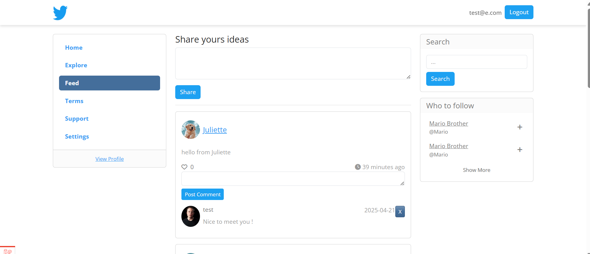
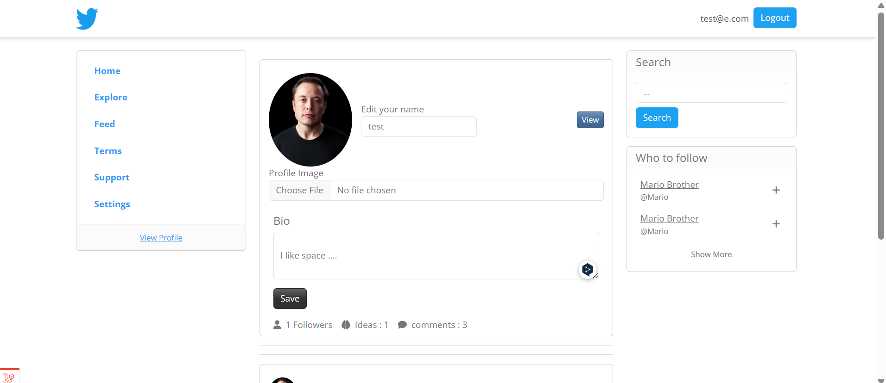
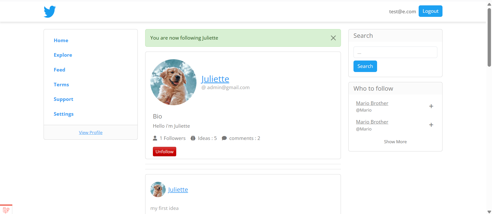

<p align="center"><a href="https://laravel.com" target="_blank"></a></p>

<p align="center">
<a href="https://github.com/laravel/framework/actions"></a>
<a href="https://packagist.org/packages/laravel/framework"></a>
<a href="https://packagist.org/packages/laravel/framework"></a>
<a href="https://packagist.org/packages/laravel/framework"></a>
</p>

# Laravel Twitter Clone 🐦


A social media web application built with **Laravel** that mimics core features of **Twitter**. This clone project showcases authentication, tweeting, following, liking, and more — all made with clean MVC architecture and modern web practices.


## 🔧 Features

- User Authentication (Login, Register, Logout)
- Create, Edit, Delete Tweets
- Like/Unlike Tweets
- Follow/Unfollow Users
- User Profiles & Timelines

## 🚀 Tech Stack

- PHP (Laravel Framework)
- MySQL
- Blade Templating Engine
- TailwindCSS / Bootstrap
- Git & GitHub

## 🛠️ Installation

1. Clone the repo:
   ```bash
   git clone https://github.com/Juliettelfkk/laravel-twitter-clone.git
   cd laravel-twitter-clone

Install dependencies:
   composer install
   npm install 

Create .env and setup your database
Update .env with your DB credentials and run migrations

    php artisan migrate
    php artisan serve


## 📸 Screenshots

### 🏠 Home Page


### 👤 Profile Page




## License

The Laravel framework is open-sourced software licensed under the [MIT license](https://opensource.org/licenses/MIT).
